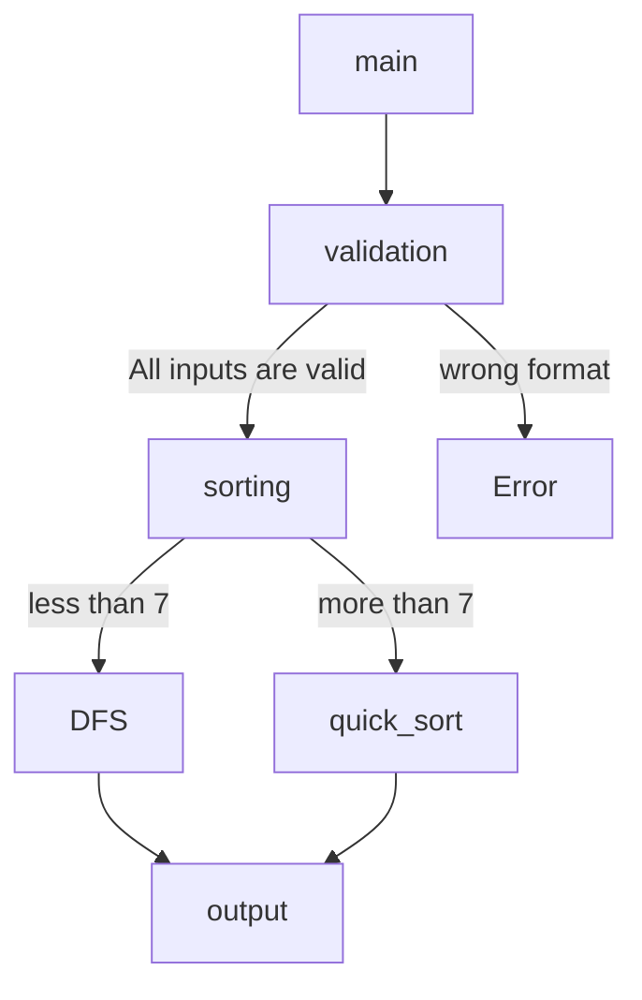

# Push_swap

The **Push_swap** project is a very simple and highly effective algorithm project: data will
need to be sorted. You have at your disposal a set of int values, 2 stacks and a set of
instructions to manipulate both stacks.

Write 2 programs in C:

- **./checker** :The first, named checker which takes integer arguments and reads instructions on
the standard output. Once read, checker executes them and displays OK if integers
are sorted. Otherwise, it will display KO.

- **./push_swap** : The second one called push_swap which calculates and displays on the standard
output the smallest progam using Push_swap instruction language that sorts inte-
ger arguments received.

To do this you have the following operations at your disposal:
| Operations | discription |
| -- | -- |
| sa | swap a - swap the first 2 elements at the top of stack a. Do nothing if there is only one or no elements)|
| sb | swap b - swap the first 2 elements at the top of stack b. Do nothing if there is only one or no elements).|
| ss | sa and sb at the same time |
| pa | push a - take the first element at the top of b and put it at the top of a. Do nothing if b is empty.|
| pb | push b - take the first element at the top of a and put it at the top of b. Do nothing if a is empty.|
| ra | rotate a - shift up all elements of stack a by 1. The first element becomes the last one.|
| rb | rotate b - shift up all elements of stack b by 1. The first element becomes the last one.|
| rr | ra and rb at the same time.|
| rra | reverse rotate a - shift down all elements of stack a by 1. The last element|
| rrb | reverse rotate b - shift down all elements of stack b by 1. The last element becomes the first one.|
| rrr | rra and rrb at the same time|

## Makefile help
Makefile compiles three different programme, libft (C library), push_swap and checker. How to see the make command options:
```
make help
```


## Test script
The scrip tests push_swap with random numbers between INT_MIN and INT_MAX for 200 times as default. How to see the options:
```
bash eval_tests/push_swap_test.sh
```


For example, test 10 random numbers between 1 and 100 for 10 times
```
bash eval_tests/push_swap_test.sh 10 1 100 -t 10 -d
```


## Programme highlight
### Double linked list
The two stacks are implemented with a double linked list. The double-linked list starts with dummy node to reach the top and the last node easily. 

### Deep first search
The numbers less than 7 are sorted by the deep first search.  The programme explores as far as possible along each branch to find the minimum solution. If the current way is the minimum, update the answer and go backtracking.
### Quick sort
The numbers more than 7 are sorted by quick sort. All numbers in the stacks are given the index of ascending order in the beginning. By using the index, move the numbers more than half in another stack. If the programme finds the next index move it to the bottom of stack A. Continuing this move, the numbers in the stack are sorted efficiently. Easier to understand by watching visualizer video in below.


## Bonus: Visualizer
1. Visualise the numbers : -v options for checker
```
./push_swap 9 6 7 1 4 2 10 8 3 5 | ./checker -v 9 6 7 1 4 2 10 8 3 5
````


https://user-images.githubusercontent.com/61685238/194748983-8d43e769-1b1d-456e-8be9-ebf888016d07.mov


2. Pygame visualizer
Please install pygame and term_printer to run the visualizer
```
pip3 install term_printer
pip3 install pygame
```
Run the visualizer
```
python3 bonus/visualizer.py 
````
https://user-images.githubusercontent.com/61685238/193667484-22919b1a-fd21-4db0-ab76-b738367523eb.mov
## Flowchart



