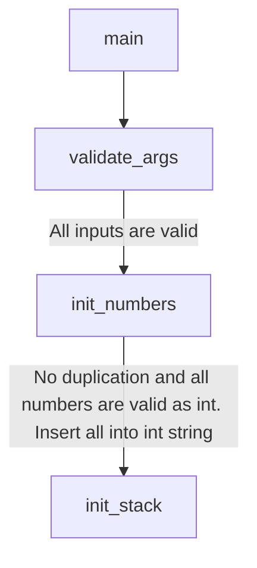

# Push_swap

The **Push_swap** project is a very simple and highly effective algorithm project: data will
need to be sorted. You have at your disposal a set of int values, 2 stacks and a set of
instructions to manipulate both stacks.

Write 2 programs in C:

- The first, named checker which takes integer arguments and reads instructions on
the standard output. Once read, checker executes them and displays OK if integers
are sorted. Otherwise, it will display KO.

- The second one called push_swap which calculates and displays on the standard
output the smallest progam using Push_swap instruction language that sorts inte-
ger arguments received.


## Makefile help
How to see the make command options:
```
make help
```


## Programmes
### Double linked list
The two stacks are implemented with double linked list. The double linked list start with dummy node to reach the top and the last node easily.


## Algorithm


## Bonus: Visualizer


https://user-images.githubusercontent.com/61685238/193667484-22919b1a-fd21-4db0-ab76-b738367523eb.mov


## Flowchart



